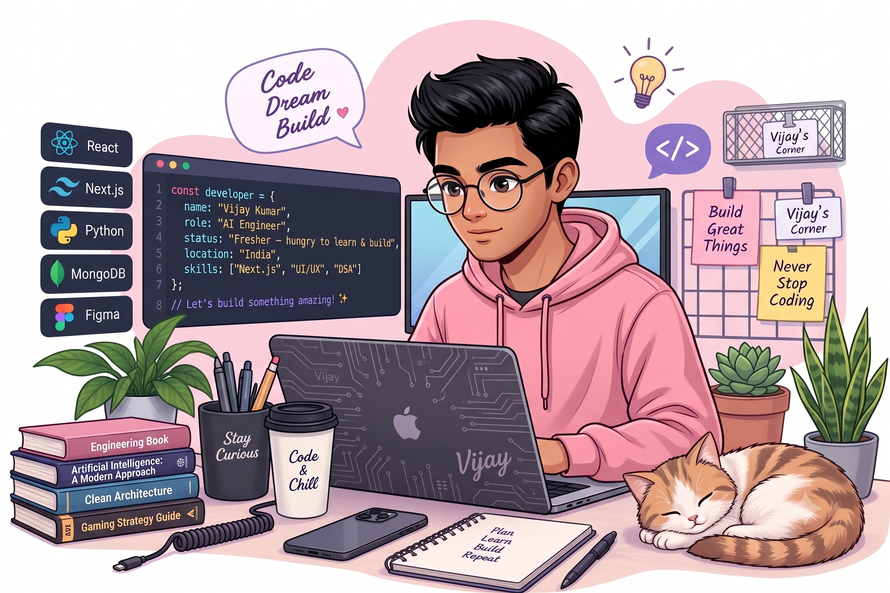

<div align="center">


<br/>

<a href="https://www.linkedin.com/in/mr-vijaykumar/"></a>
<a href="https://myportfolio-vijaykumar.vercel.app/"></a>
<a href="mailto:vijay8341316695@gmail.com"></a>
<a href="https://github.com/vijay-0553"></a>

<br/><br/>


</div>

&nbsp;


## About Me


```yaml
vijay_kumar:
  role: "AI Engineer"
  status: "Fresher — hungry to learn & build"
  location: "India"
  focus:
    - Machine Learning & Deep Learning
    - Computer Vision Applications
    - Full-Stack AI-Powered Products
  currently_exploring:
    - Advanced System Design
    - Cloud Deployment (AWS)
    - DevOps & Containerization
  philosophy: "Build in public. Learn by shipping."
```

- Fresher AI Engineer with strong fundamentals in **ML, DL & Full-Stack Development**
- Passionate about building real-world, production-ready AI solutions
- Constantly upskilling in **System Design, Docker, AWS & DevOps**
- Open to **entry-level AI/ML Engineer roles** and collaborative projects
- Enjoys turning research papers into working prototypes

<br clear="right"/>


## Tech Stack

<div align="center">


<br/><br/>


</div>


## GitHub Analytics


<div align="center">


<br/><br/>


</div>


## Contribution Snake

<div align="center">

<picture>
  <source media="(prefers-color-scheme: dark)" srcset="https://raw.githubusercontent.com/vijay-0553/vijay-0553/output/github-contribution-grid-snake-dark.svg" />
  <source media="(prefers-color-scheme: light)" srcset="https://raw.githubusercontent.com/vijay-0553/vijay-0553/output/github-contribution-grid-snake-dark.svg" />
  
</picture>

</div>


## Featured Projects

<div align="center">

<table width="100%">
<tr>
<td width="50%" valign="top">

<h3 align="center">Fitness Tracker</h3>

<p align="center">An intelligent fitness tracking application that helps users log workouts, monitor progress, and receive data-driven insights to stay consistent with their health goals.</p>

<p align="center">


</p>

<p align="center">
<a href="https://github.com/vijay-0553"></a>
<a href="https://myportfolio-vijaykumar.vercel.app/"></a>
</p>

</td>
<td width="50%" valign="top">

<h3 align="center">Pediatric Pupillometry Disease Detection</h3>

<p align="center">An AI-powered computer vision system that analyzes pupillary response in pediatric patients to assist in early detection of neurological and ophthalmic conditions.</p>

<p align="center">


</p>

<p align="center">
<a href="https://github.com/vijay-0553"></a>
<a href="https://myportfolio-vijaykumar.vercel.app/"></a>
</p>

</td>
</tr>
</table>

</div>


## Currently Learning

<div align="center">


</div>


## Achievement Badges

<div align="center">


</div>


## Let's Connect

<div align="center">

I'm actively looking for **AI/ML Engineer** opportunities. Feel free to reach out — I'd love to collaborate, learn, and build something impactful together.

<a href="https://github.com/vijay-0553"></a>
<a href="https://www.linkedin.com/in/mr-vijaykumar/"></a>
<a href="https://myportfolio-vijaykumar.vercel.app/"></a>
<a href="mailto:vijay8341316695@gmail.com"></a>

</div>

<br/>


<div align="center">

<sub>From <b>Vijay Kumar</b> — thanks for stopping by. Feel free to star repos you find interesting.</sub>

</div>
